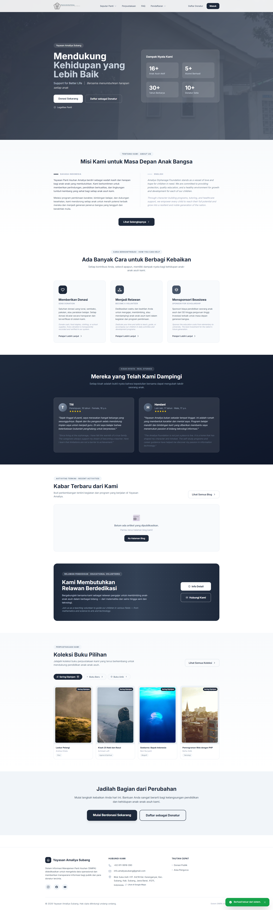
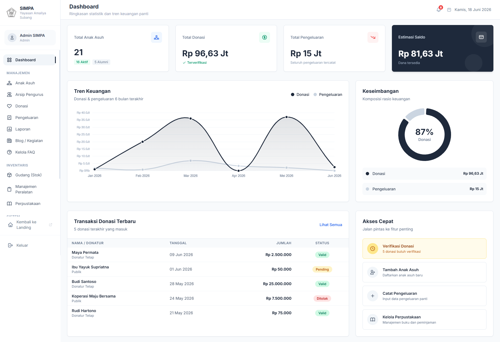
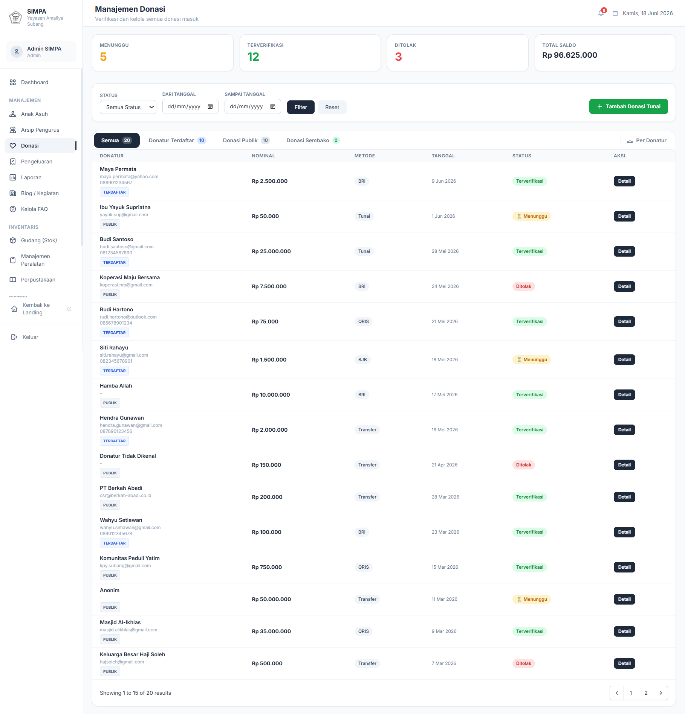
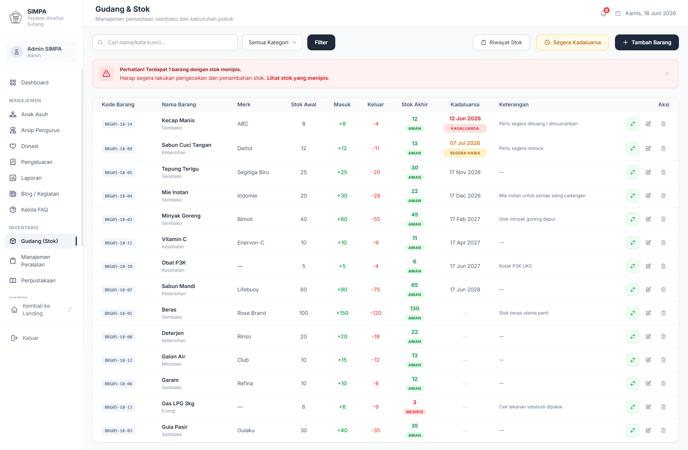

<h1 align="center">
  <br>
  🏠 SIMPA
  <br>
  Sistem Informasi Manajemen Panti Asuhan
</h1>

<p align="center">
  <strong>Aplikasi web berbasis Laravel untuk mengelola operasional Panti Asuhan Yayasan Amaliya Subang secara digital, transparan, dan efisien.</strong>
</p>

<p align="center">
  
  
  
  
  
</p>

---

## 📸 Tampilan Aplikasi

| Landing Page | Dashboard Admin |
|:---:|:---:|
|  |  |

| Manajemen Donasi | Manajemen Stok Gudang |
|:---:|:---:|
|  |  |

---

## 📖 Tentang Proyek

**SIMPA** (Sistem Informasi Manajemen Panti Asuhan) adalah aplikasi web yang dikembangkan sebagai solusi digitalisasi operasional **Panti Asuhan Yayasan Amaliya Subang**. Sistem ini menggantikan pencatatan manual yang selama ini dilakukan, sehingga pengelolaan data lebih terstruktur, transparan, dan mudah diakses.

Proyek ini dikembangkan sebagai **Tugas Akhir Semester 4** dengan menerapkan metodologi pengembangan perangkat lunak nyata dan berorientasi pada kebutuhan pengguna langsung (Yayasan).

---

## ✨ Fitur Utama

### 👥 Multi-Role Akses (4 Peran Pengguna)
| Role | Akses |
|---|---|
| **Admin** | Pengelolaan penuh seluruh sistem |
| **Ketua** | Laporan, persetujuan, dan monitoring |
| **Bendahara** | Manajemen keuangan dan donasi |
| **Donatur** | Dashboard donasi pribadi & histori |

### 💰 Manajemen Donasi
- Input donasi tunai maupun barang
- Riwayat dan laporan donasi per donatur
- Cetak kwitansi/receipt donasi (PDF)
- Verifikasi dan penolakan donasi oleh admin

### 👦 Data Anak Asuh
- Profil lengkap anak asuh (data diri, pendidikan, kesehatan)
- Pencatatan prestasi anak
- Manajemen status aktif/alumni

### 🏦 Keuangan (Kas Masuk & Keluar)
- Pencatatan pemasukan dan pengeluaran kas
- Laporan keuangan bulanan
- Tracking sumber dana

### 📦 Stok & Inventaris Gudang
- Pencatatan stok barang kebutuhan panti
- Manajemen inventaris peralatan
- Riwayat transaksi barang masuk & keluar

### 📚 Perpustakaan
- Katalog buku digital
- Sistem peminjaman buku untuk donatur
- Tracking status peminjaman

### 📝 Artikel & Blog
- Publikasi artikel/berita kegiatan panti
- Halaman publik yang bisa diakses tanpa login

### 🔔 Pendaftaran Akun Donatur
- Formulir pengajuan akun donatur online
- Notifikasi email otomatis saat disetujui
- Sistem password sementara terenkripsi

### 📄 Legalitas & Transparansi
- Dokumen legalitas panti dapat dilihat publik
- Halaman landing page informatif untuk calon donatur

---

## 🛠️ Teknologi yang Digunakan

| Kategori | Teknologi |
|---|---|
| **Backend Framework** | Laravel 9 (PHP 8.2) |
| **Frontend** | Blade Template, Tailwind CSS, Alpine.js |
| **Database** | MySQL 8 |
| **Authentication** | Laravel Sanctum + Custom Role Middleware |
| **Email** | Laravel Mail (SMTP) |
| **Storage** | Laravel Filesystem (Local/Cloud) |
| **Deployment** | Railway (Cloud) / XAMPP (Lokal) |
| **Version Control** | Git & GitHub |

---

## 🚀 Cara Instalasi (Lokal)

### Prasyarat
- PHP >= 8.2
- Composer
- MySQL
- Node.js & NPM

### Langkah Instalasi

```bash
# 1. Clone repositori
git clone https://github.com/padlleee/SIMPA.git
cd SIMPA

# 2. Install dependensi PHP
composer install

# 3. Install dependensi Node
npm install

# 4. Salin file environment
cp .env.example .env

# 5. Generate application key
php artisan key:generate

# 6. Konfigurasi database di file .env
# DB_DATABASE=simpa
# DB_USERNAME=root
# DB_PASSWORD=

# 7. Jalankan migrasi dan seeder
php artisan migrate --seed

# 8. Buat symlink storage
php artisan storage:link

# 9. Kompilasi aset frontend
npm run dev

# 10. Jalankan server
php artisan serve
```

Buka browser dan akses: `http://localhost:8000`

---

## 🔑 Akun Default (Setelah Seeder)

| Role | Email | Password |
|---|---|---|
| Admin | `admin@simpa.com` | `password` |
| Ketua | `ketua@simpa.com` | `password` |
| Bendahara | `bendahara@simpa.com` | `password` |

> ⚠️ Segera ubah password setelah login pertama kali.

---

## 📁 Struktur Proyek

```
SIMPA/
├── app/
│   ├── Http/Controllers/    # Semua controller aplikasi
│   ├── Models/              # Eloquent models
│   └── Http/Middleware/     # Custom middleware (role, password)
├── database/
│   ├── migrations/          # Skema database
│   └── seeders/             # Data awal (admin, FAQ, dll)
├── resources/views/         # Blade templates (halaman web)
├── routes/web.php           # Definisi semua route
├── docs/screenshots/        # Screenshot tampilan aplikasi
└── public/                  # Aset publik (CSS, JS, gambar)
```

---

## 👨‍💻 Tim Pengembang

Proyek ini dikembangkan oleh Kelompok Mahasiswa Semester 4 sebagai Tugas Project Semester Pada Prodi Sistem Informasi

---

## 📄 Lisensi

Proyek ini dikembangkan untuk keperluan akademis dan pengabdian kepada masyarakat (Panti Asuhan Yayasan Amaliya Subang). Tidak untuk diperjualbelikan.
